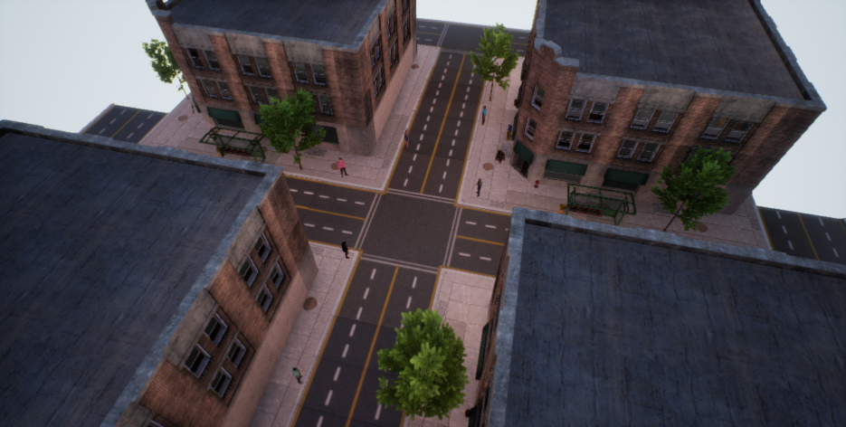
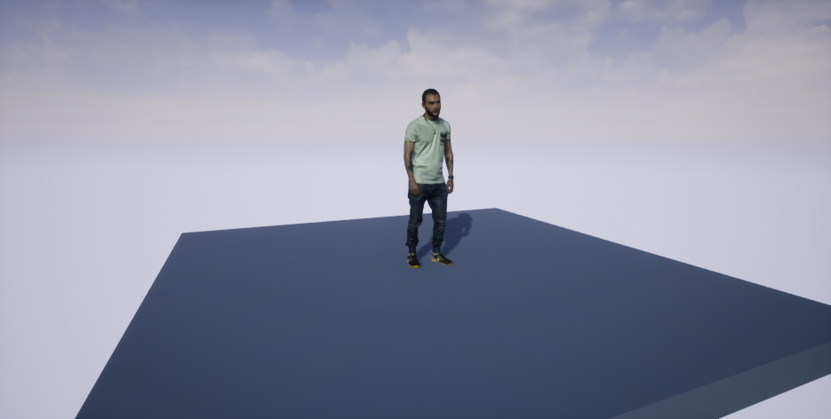
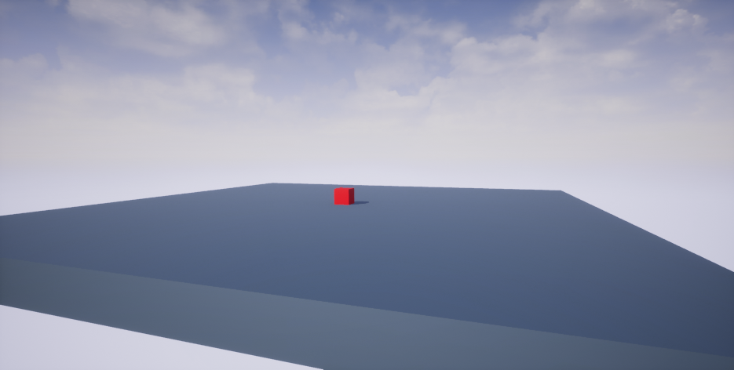

# gym-airsim
OpenAI Gym-compatible environments of AirSim for multirotor control in RL problems. All gym environments have corresponding Unreal Engine environments that are provided in the release section ready for use (Linux only).

# Unreal Engine Environments
The Unreal Engine project provided in the releases section constists of 3 environments. Some simple commands for 
the UE console are provided. Launch the project and press the back quote/tilde button(~) on your keyboard to open
the console and type one of the following (without quotes):
* "open MultiHumanCity" : Open the MultiHumanCity environment map.
* "open StaticHuman" : Open the StaticHuman environment map.
* "open StaticCube" : Open the StaticCube environment map.
* "fullscreen" : Toggle between fullscreen and windowed mode.
* "exit" : Exit the simulator.

### MultiHumanCity
This environment represent a small part of a city. It consists of four buildings, bus stops, trees and other small 
items. This city includes 9 different 3D models of humans with a variety of clothing and facial features. The humans
have a small idling animation.

### StaticHuman
This environment consists of a square platform and the 3D model of a human in its center. The background is a simple 
skybox.

### StaticCube
This environment consists of a square platform with a red cube in its center. The background is a simple skybox. 
Really simple environment for starting off with tracking tasks and AirSim.

# Gym Environments
### FrontalShotDroneOnlyMulti
**Corresponding Unreal Engine Environmet:** MultiHumanCity

**Description:**
The agent has to move the drone in front of the person's face in
order to get a frontal close-up shot. In this environment there
are 9 different people.

**Observation:**
A (200)x(200) color image taken from the bottom_center camera of the
AirSim drone. The resolution of the observation image is determined
in the AirSim settings.

**Actions:**
Type: Discrete(9)
* 0   Drone forwards
* 1   Drone backwards
* 2   Drone left
* 3   Drone right
* 4   Drone up
* 5   Drone down
* 6   Drone yaw left
* 7   Drone yaw right
* 8   Do nothing

**Reward:**
The reward depends on the drone's distance from the frontal position
and the angle between the target's direction and the drone's look
direction.

**Starting State:**
The drone is placed in a random position in front of a random target
human facing towards him.

**Episode Termination:**
The person's face moves out of the camera frame.
The drone moves far away from the person's face.
The drone collides with another object.
20 seconds pass from the beggining of the episode.

### FrontalShotContMulti
**Corresponding Unreal Engine Environmet:** MultiHumanCity

**Description:**
The agent has to move the drone in front of the person's face in
order to get a frontal close-up shot. In this environment there
are 9 different people.

**Observation:**
A (200)x(200) color image taken from the front_center camera of the
AirSim drone. The resolution of the observation image is determined
in the AirSim settings.

**Actions:**
Type: Box(5)
* 0   Drone forwards/backwards
* 1   Drone left/right
* 2   Drone up/down
* 3   Camera tilt up/down
* 4   Camera pan left/right

**Reward:**
The reward depends on the drone's distance from the frontal position
and the angle between the target's direction and the drone's look
direction.

**Starting State:**
The drone is placed in a random position in front of a random target
human facing towards him.

**Episode Termination:**
The person's face moves out of the camera frame.
The drone moves far away from the person's face.
The drone collides with another object.
20 seconds pass from the beggining of the episode.

### FrontalShotDroneOnly
**Corresponding Unreal Engine Environmet:** StaticHuman

**Description:**
The agent has to move the drone in front of the person's face in
order to get a frontal close-up shot.

**Observation:**
A (200)x(200) color image taken from the bottom_center camera of the
AirSim drone. The resolution of the observation image is determined
in the AirSim settings.

**Actions:**
Type: Discrete(9)
* 0   Drone forwards
* 1   Drone backwards
* 2   Drone left
* 3   Drone right
* 4   Drone up
* 5   Drone down
* 6   Drone yaw left
* 7   Drone yaw right
* 8   Do nothing

**Reward:**
The reward depends on the drone's distance from the frontal position
and the angle between the target's direction and the drone's look
direction.

**Starting State:**
The drone is placed in a random position in front of the target
human facing towards him.

**Episode Termination:**
The person's face moves out of the camera frame.
The drone moves far away from the person's face.
The drone collides with another object.
10 seconds pass from the beggining of the episode.

### FrontalShotCont
**Corresponding Unreal Engine Environmet:** StaticHuman

**Description:**
The agent has to move the drone in front of the person's face in
order to get a frontal close-up shot.

**Observation:**
A (200)x(200) color image taken from the bottom_center camera of the
AirSim drone. The resolution of the observation image is determined
in the AirSim settings.

**Actions:**
Type: Box(5)
* 0   Drone forwards/backwards
* 1   Drone left/right
* 2   Drone up/down
* 3   Camera tilt up/down
* 4   Camera pan left/right

**Reward:**
The reward depends on the drone's distance from the frontal position
and the angle between the target's direction and the drone's look
direction.

**Starting State:**
The drone is placed in a random position in front of the target
human facing towards him.

**Episode Termination:**
The person's face moves out of the camera frame.
The drone moves far away from the person's face.
The drone collides with another object.
10 seconds pass from the beggining of the episode.

### FollowTargetCamOnly
**Corresponding Unreal Engine Environmet:** StaticCube

**Description:**
The drone performs a random trajectory and the agent has to keep
track of the red cube using only the drone's camera.

**Observation:**
A (256)x(144) color image taken from the bottom_center camera of the
AirSim drone. The resolution of the observation image is determined
in the AirSim settings.

**Actions:**
Type: Discrete(5)
* 0   Do nothing
* 1   Tilt drone camera up
* 2   Tilt drone camera down
* 3   Pan drone camera left
* 4   Pan drone camera right

**Reward:**
Reward depends on the distance of the red cube from the center of the
camera's frame.

**Starting State:**
Drone starts in a random position in the air with the camera pointed
at the direction of the red cube.
Episode Termination:
Cube moves out of the camera frame.
Drone completes the trajectory and stops moving.

